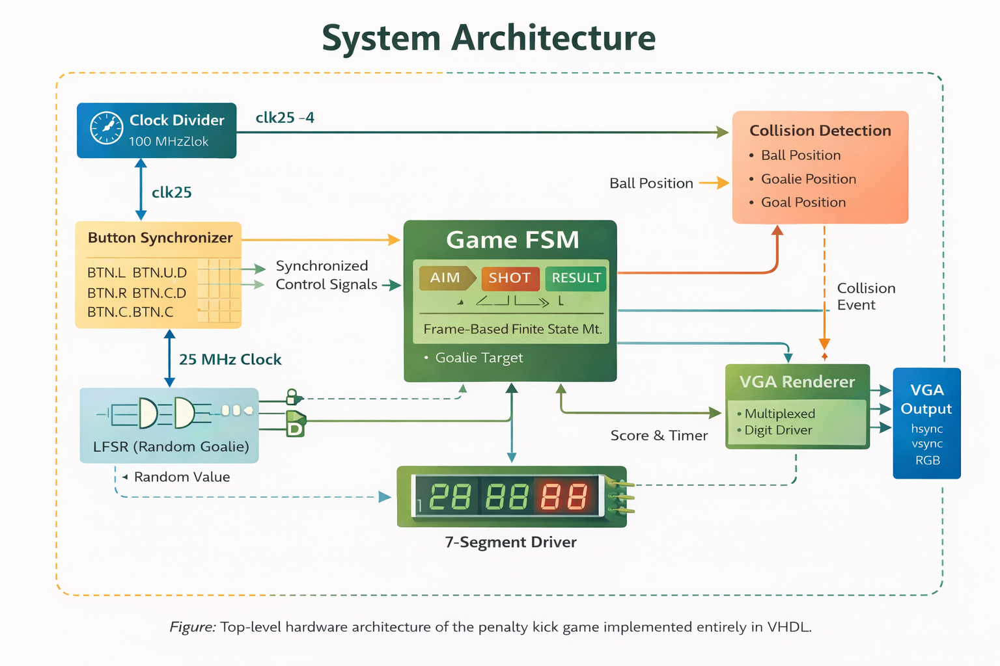

# Nexys A7 VGA Penalty Kick Game
A custom FPGA game implemented in **VHDL** for the **Nexys A7** board.  
The player aims a penalty kick using onboard buttons, adjusts power using an oscillating power meter, and shoots toward the goal while a goalie dives left/center/right with pseudo‑random logic.

---

## 1. Expected Behavior of the Project
- Displays a **soccer field**, **goal**, **ball**, and **goalie** on a VGA monitor (800×600).
- Player uses **BTNL/BTNR/BTNU/BTND** to aim a crosshair.
- Player uses **BTNC** to shoot.
- A **power meter bar** oscillates and determines shot speed.
- A **pseudo‑random LFSR** chooses one of three goalie dives (left, center, right).
- A **collision detection system** determines whether the goalie blocks the shot.
- Displays **“GOAL!”** or **“MISS!”** in comic‑style text.
- A **60‑second timer** runs; total goals are displayed on the **7‑segment display**.
- **High score** is saved for the session.
- Game loops until timer expires.

### Required Attachments
- Nexys A7 board  
- VGA cable  
- Power supply  

### System Diagram  

---

## 2. Steps to Build & Run in Vivado
1. Create a new **RTL project** in Vivado.  
2. Add:
   - `penalty_top.vhd`
   - `vga_sync.vhd`
   - `nexys_a7_penalty.xdc`
3. Set `penalty_top` as the **top module**.
4. Generate bitstream.
5. Open **Hardware Manager**, program the Nexys board via USB.
6. Connect VGA monitor and press **reset** to start the game.

---

## 3. Inputs and Outputs (Nexys A7)

### Inputs
| Nexys Button | Function |
|--------------|----------|
| **BTNL** | Move aim left |
| **BTNR** | Move aim right |
| **BTNU** | Move aim up |
| **BTND** | Move aim down |
| **BTNC** | Shoot |

### Outputs
| Output | Function |
|--------|----------|
| **VGA (R,G,B,HS,VS)** | Full graphics output |
| **7‑segment display** | Shows current score or high score |
| **LEDs (optional)** | Can be used for debugging |

### Added / Modified Ports (Required by Assignment)
- Added button inputs for aim & shooting  
- Added VGA output ports  
- Added 7‑segment output ports  
- Updated `.xdc` constraints to include all above

---

## 4. Images / Videos of Project Running
*(Add photos of gameplay here)*  
*(Add video link if you have one)*

---

## 5. Modifications Made (15 Points Section)

Our project began from:
- A basic **VGA timing generator** (`vga_sync.vhd`)  
- A basic **blank top‑module template**

We added and modified:

### **Added Features**
- Full **penalty kick game engine**
- **Pseudo‑random goalie behavior** using 8‑bit LFSR  
- **Three‑state goalie dives** (L / C / R) with no repeats  
- **Full collision detection** (circle‑vs‑rectangle)  
- **Oscillating power meter** with variable speed  
- **Crosshair aiming system**  
- **60‑second timer + high‑score memory**  
- **Custom text renderer ("GOAL!"/"MISS!")**  
- **7‑segment decoder + multiplexing driver**  
- **VGA renderer with field, goal, ball, and UI graphics**

### **Starter Code Used**
- `vga_sync.vhd` (Digilent standard VGA timing module)  
- Everything else written or rewritten by the group.

---

## 6. Project Summary, Roles, Timeline, Difficulties

### Roles
- **Aayush** – Game logic, goalie movement, collision detection  
- **Ardit** – Documentation, Vivado setup, constraints file, testing  
- **Anthony** – Graphics, ball sprite integration, UI elements  

### Timeline
- Week 1: Basic VGA output + field rendering  
- Week 2: Aim controls, ball physics, goalie movement  
- Week 3: Collision detection & scoring  
- Week 4: Power meter, text graphics, 7‑segment display  
- Week 5: Final debugging + polishing + README  

### Difficulties & Solutions
- **Goalie vibrating at boundaries** → added clamping logic  
- **Goal deciding incorrectly** → refined collision box  
- **7‑segment showing hex instead of decimal** → fixed decoder + digit select  
- **Power meter too slow** → added speed constant  
- **Repeat goalie dives** → enforced no‑repeat logic  

